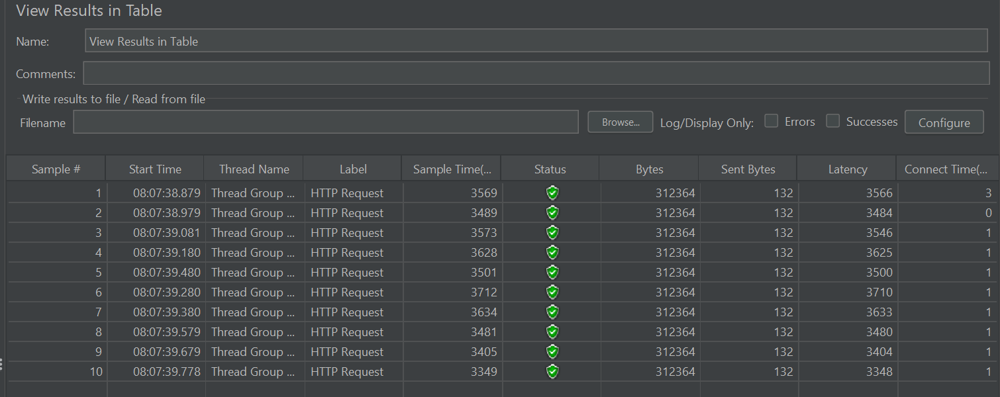
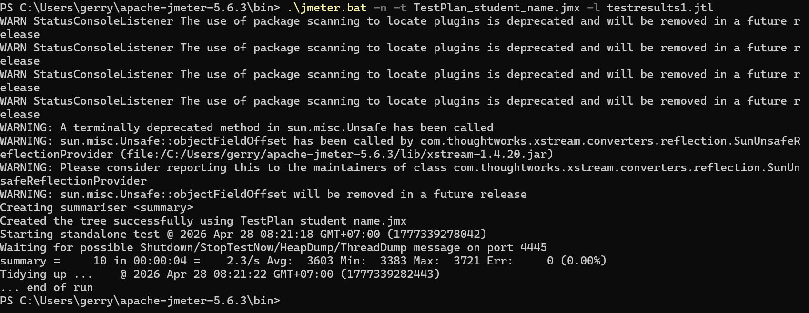
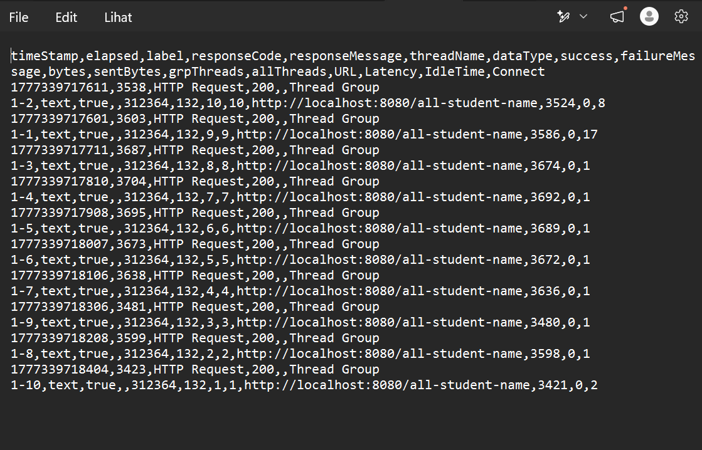
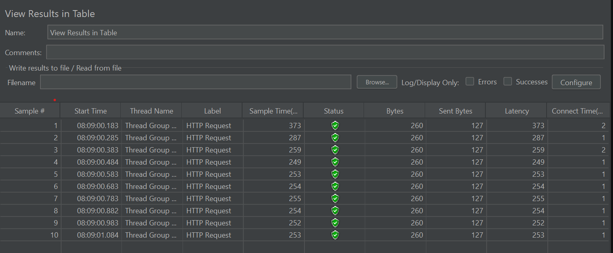
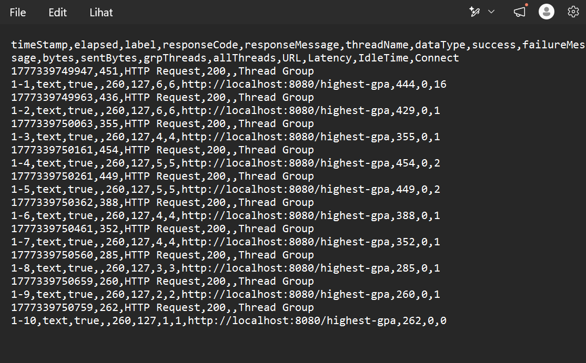
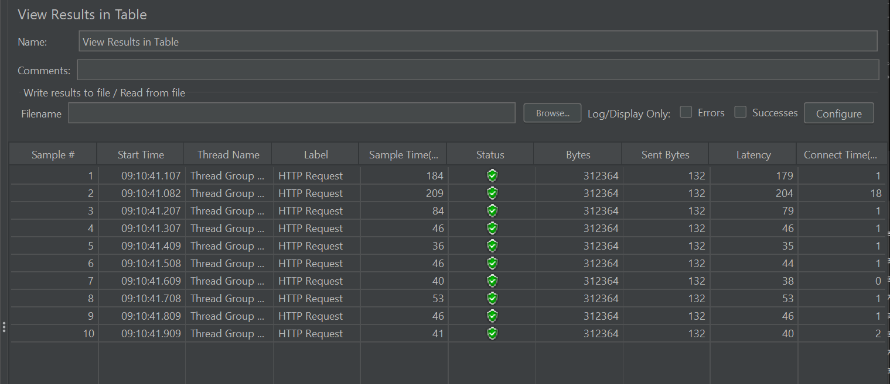
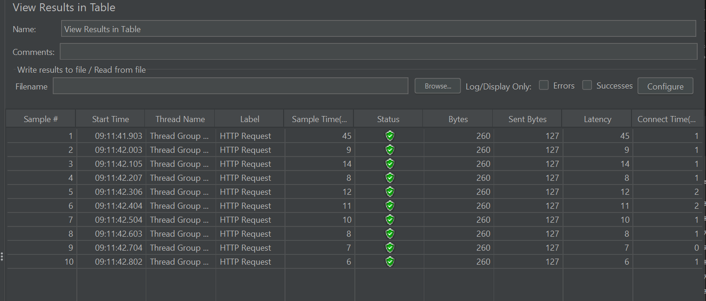

# Modul 7 Profiling

## Screenshots hasil sebelum refactor
#### Table /all-student-name

#### CLI /all-student-name

#### Log /all-student-name

#### Table /highest-gpa

#### CLI /highest-gpa

#### Log /highest-gpa

## Screenshots hasil sesudah refactor
#### Table /all-student-name

#### Table /highest-gpa

## Conclusion Test
Berdasarkan hasil pengujian ulang menggunakan JMeter, dapat disimpulkan bahwa proses refactoring dan optimasi kode telah berhasil meningkatkan performa aplikasi secara signifikan . Dengan mendelegasikan tugas pengolahan data seperti pengurutan dan proyeksi langsung ke tingkat database PostgreSQL, serta menyelesaikan masalah N+1 query dan penumpukan string di memori, beban kerja CPU pada aplikasi menjadi jauh lebih ringan. Hal ini dibuktikan langsung oleh log hasil JMeter yang menunjukkan adanya penurunan waktu respons rata-rata (Average Sample Time) yang drastis sekaligus peningkatan throughput sistem secara keseluruhan pada ketiga endpoint tersebut.

## Reflection
1. Pendekatan JMeter berfokus pada pengujian beban end-to-end dari sudut pandang eksternal klien dengan mensimulasikan banyak pengguna secara bersamaan untuk melihat waktu respons keseluruhan, sedangkan IntelliJ Profiler berfokus pada inspeksi internal di tingkat virtual machine Java untuk mengukur secara presisi seberapa banyak waktu CPU dan memori yang dihabiskan oleh masing-masing metode di dalam kode.

2. Proses profiling membantu dengan cara memetakan eksekusi kode secara visual dan kuantitatif, sehingga pengembang tidak perlu menebak-nebak letak masalah melainkan dapat langsung melihat fungsi spesifik mana yang memakan waktu eksekusi terbesar dan menjadi akar perlambatan (bottleneck) di dalam sistem.

3. Ya, alat ini sangat efektif karena integrasinya yang langsung di dalam IDE memungkinkan inspeksi kode secara instan menggunakan visualisasi flame graph dan daftar metode, sehingga masalah seperti N+1 query atau pemborosan memori dapat diisolasi dan dianalisis seketika.

4. Tantangan utamanya adalah menghindari metrik yang bias akibat overhead kompilasi Just-In-Time (JIT) pada JVM yang belum optimal saat aplikasi baru saja dinyalakan, dan tantangan ini diatasi dengan metode pemanasan (warm-up) dengan melakukan hit beberapa kali sebelum proses perekaman performa benar-benar dimulai.

5. Manfaat utama yang didapatkan adalah kemampuan diagnosis performa berbasis data yang sangat akurat hingga ke tingkat pemanggilan baris kode, sehingga memfasilitasi pengambilan keputusan refactoring yang didasarkan pada bukti metrik yang nyata, bukan sekadar asumsi teoritis.

6. Jika terjadi inkonsistensi, saya akan menganalisis faktor eksternal di luar kode aplikasi itu sendiri karena Profiler hanya mengukur eksekusi internal JVM, sedangkan JMeter menangkap total waktu respons yang bisa saja melambat akibat isu infrastruktur seperti latensi jaringan, antrean koneksi database, atau keterbatasan resource I/O pada sistem operasi.

7. Strategi pengoptimalan difokuskan pada pendelegasian proses komputasi seperti sorting dan filtering langsung ke tingkat database menggunakan custom query dan proyeksi, di mana keutuhan fungsionalitas dijamin dengan memverifikasi secara langsung bahwa respons API yang dikembalikan setelah refactoring memiliki struktur data dan nilai yang sama persis dengan versi sebelumnya.